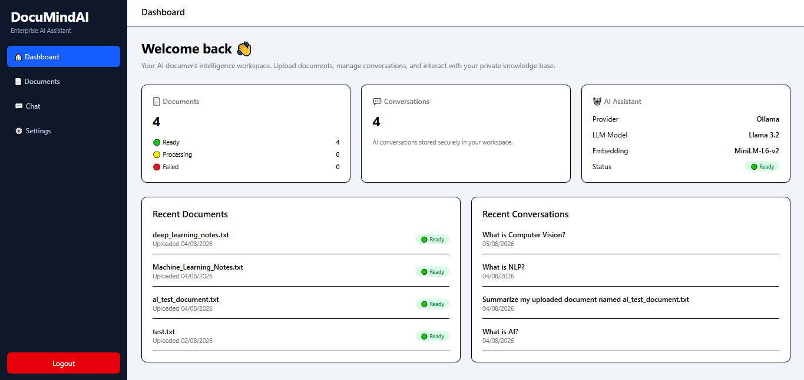
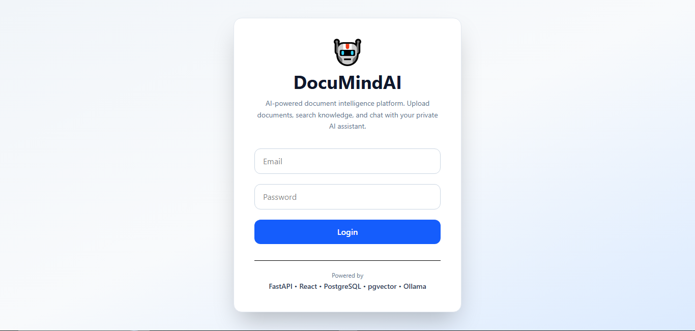
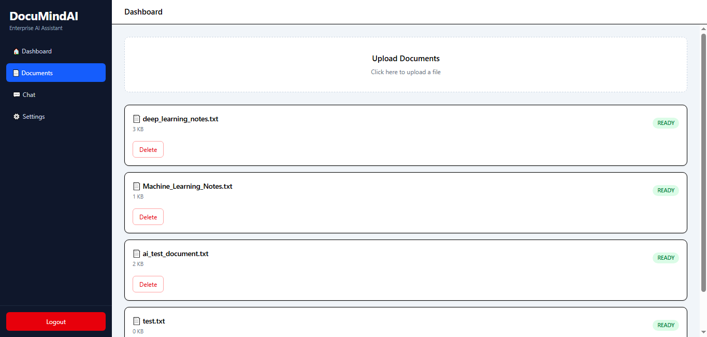
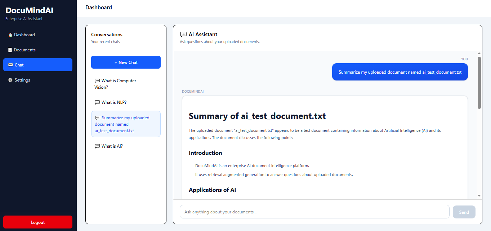
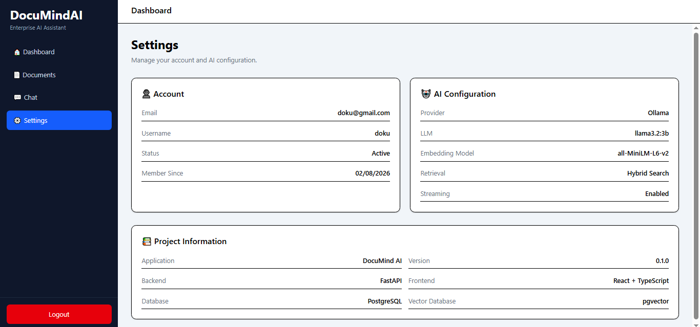
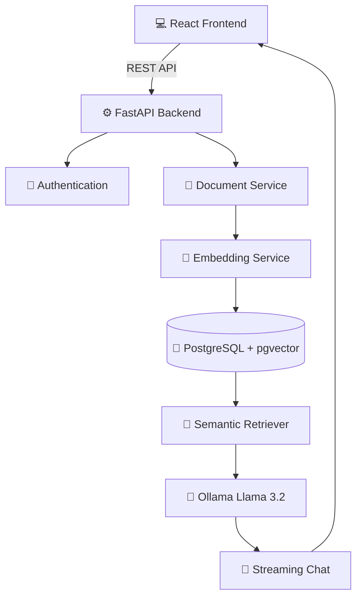

# 🤖 DocuMindAI


An enterprise-style AI Document Intelligence Platform that enables users to upload documents, build a private knowledge base, and interact with their documents through Retrieval-Augmented Generation (RAG), semantic search, and local Large Language Models.

> Designed to demonstrate production-style AI software engineering practices including modern backend architecture, vector databases, authentication, streaming APIs, and full-stack development.

<p align="center">
  
</p>

---

# 🎯 Project Goals

This project was built to demonstrate the design and implementation of a modern AI-powered Document Intelligence Platform using Retrieval-Augmented Generation (RAG).

The focus was on building a production-style application featuring:

- Modular software architecture
- RESTful API development
- JWT Authentication
- Vector database integration
- Semantic document retrieval
- Streaming AI responses
- Interactive React frontend
- Dockerized development workflow

---

# ✨ Features

- 🔐 JWT Authentication
- 👤 User Registration & Login
- 📄 Document Upload
- 📚 Automatic Document Processing
- 🧠 Semantic Vector Search
- 🤖 AI Chat Assistant
- ⚡ Streaming Responses
- 💬 Conversation History
- 📝 Automatic Conversation Titles
- 📊 Dashboard Analytics
- ⚙️ User Settings
- 🐳 Docker Support

---

# ⭐ Key Highlights

- Enterprise AI Document Intelligence Platform
- Retrieval-Augmented Generation (RAG)
- Semantic search using pgvector
- Local LLM integration with Ollama
- Streaming AI responses
- JWT Authentication
- PostgreSQL vector database
- Modern React frontend
- Clean Architecture backend
- Dockerized development environment

---

# 📸 Screenshots

## Login

<p align="center">
  
</p>

---

## Dashboard

<p align="center">
  
</p>

---

## Documents

<p align="center">
  
</p>

---

## AI Chat

<p align="center">
  
</p>

---

## Settings

<p align="center">
  
</p>

---

# 🏗️ System Architecture



---

# 🧠 RAG Pipeline


---

# ⚙️ Tech Stack

## Programming Language

- Python 3.11
- TypeScript

## Backend

- FastAPI
- SQLAlchemy
- Alembic
- Uvicorn
- Pydantic

## Frontend

- React
- Vite
- Tailwind CSS
- React Query
- Axios
- React Router

## AI & Machine Learning

- Ollama
- Llama 3.2
- Sentence Transformers
- all-MiniLM-L6-v2
- Retrieval-Augmented Generation (RAG)

## Database

- PostgreSQL
- pgvector

## Deployment & DevOps

- Docker
- Docker Compose

## Development Tools

- Git
- GitHub
- PyCharm

---

# 📊 AI Workflow

The AI assistant follows a Retrieval-Augmented Generation pipeline.

### Document Processing

- Text Extraction
- Text Chunking
- Embedding Generation
- Vector Storage

### Question Answering

- Semantic Search
- Context Retrieval
- Prompt Construction
- LLM Response Generation
- Streaming Response

---

# 📂 Project Structure

```text
DocuMindAI
│
├── backend/
│   ├── app/
│   │   ├── api/
│   │   ├── core/
│   │   ├── db/
│   │   ├── repositories/
│   │   ├── schemas/
│   │   ├── security/
│   │   └── services/
│
├── frontend/
│   ├── src/
│   │   ├── components/
│   │   ├── features/
│   │   ├── layouts/
│   │   ├── routes/
│   │   └── api/
│
├── docker/
├── docs/
└── README.md
```

---

# 🛠️ Installation

## Prerequisites

- Python 3.11+
- Node.js 20+
- PostgreSQL
- Docker *(optional)*
- Ollama

## Clone Repository

```bash
git clone https://github.com/Faizur-Rahman99/DocuMindAI.git

cd DocuMindAI
```

---

## Backend

```bash
cd backend

uv sync

alembic upgrade head

uv run uvicorn app.main:app --reload
```

---

## Frontend

```bash
cd frontend

npm install

npm run dev
```

---

## Database

```bash
docker compose up -d
```

---

## Ollama

Start Ollama

```bash
ollama serve
```

Download the model

```bash
ollama pull llama3.2:3b
```

---

# 🔌 API Overview

| Method | Endpoint | Description |
|---------|----------|-------------|
| POST | `/users/register` | Register a new user |
| POST | `/users/login` | User login |
| GET | `/documents` | Retrieve uploaded documents |
| POST | `/documents/upload` | Upload a document |
| DELETE | `/documents/{id}` | Delete document |
| POST | `/chat/stream` | Stream AI response |
| GET | `/conversations` | Retrieve conversations |
| POST | `/conversations` | Create conversation |
| GET | `/settings` | User settings |

---

# 📈 Future Improvements

## AI Enhancements

- OCR support for scanned documents
- PDF image understanding
- Multi-document reasoning
- Citation highlighting

## Platform Features

- Refresh Token Authentication
- Role-Based Access Control
- Multi-user workspaces
- Document sharing

## Deployment

- Cloud deployment
- CI/CD pipeline
- Kubernetes support
- Multiple LLM providers

---

# 📚 Learning Outcomes

This project demonstrates practical experience with:

- Retrieval-Augmented Generation (RAG)
- Semantic Search
- Vector Databases
- Large Language Models
- JWT Authentication
- Streaming APIs
- FastAPI
- React
- PostgreSQL
- Docker
- Clean Architecture

---

# 📄 License

This project is licensed under the **MIT License**, which allows you to use, modify, and distribute the software with proper attribution.

See the [LICENSE](LICENSE) file for details.

---

# 👨‍💻 Author

## Faizur Rahman

Computer Science & Engineering graduate with a strong interest in **Artificial Intelligence**, **Machine Learning**, and **Software Engineering**.

### Connect with me

- **GitHub:** [Faizur-Rahman99](https://github.com/Faizur-Rahman99)
- **LinkedIn:** [Faizur Rahman](https://www.linkedin.com/in/faizur-rahman99)

---

## ⭐ Support

If you found this project helpful or interesting, please consider giving it a ⭐ on GitHub.

Your support helps showcase the project and motivates future improvements.

Thank you for visiting!